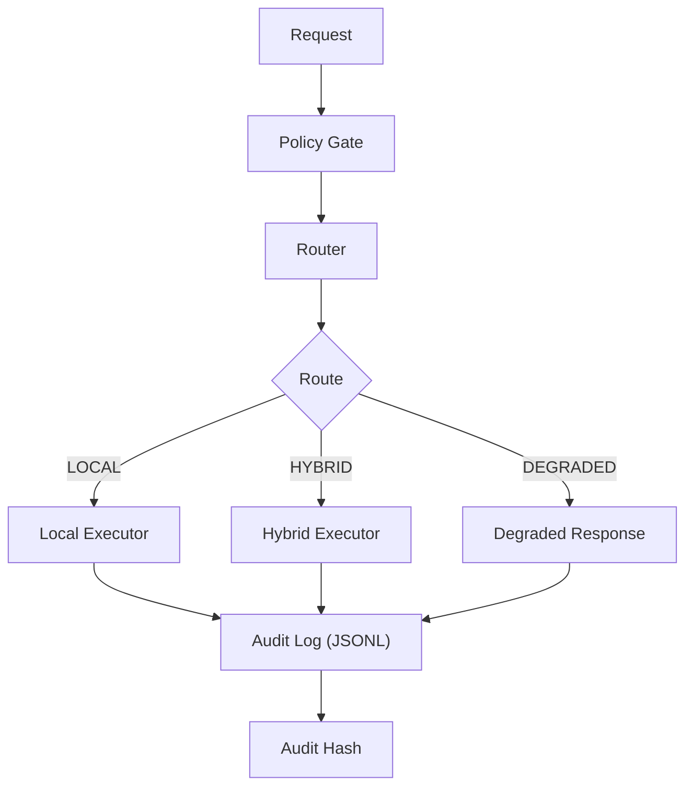

# decision-policy-engine

[](https://github.com/rafaellimatecnologia-cloud/decision-policy-engine/actions/workflows/ci.yml)
[](https://github.com/rafaellimatecnologia-cloud/decision-policy-engine)
[](https://github.com/rafaellimatecnologia-cloud/decision-policy-engine/blob/main/LICENSE)
[](https://github.com/rafaellimatecnologia-cloud/decision-policy-engine)
[](https://github.com/rafaellimatecnologia-cloud/decision-policy-engine)

## Portfolio Note (Safe-to-Publish)

This repository is intentionally scoped for public viewing. It demonstrates decision routing and auditability patterns without exposing proprietary data, models, or customer context.

Deterministic decision policy engine with auditable traces for safe, repeatable execution routing.

## Demo (3 seconds)


## Why this matters

- Predictable routing decisions reduce operational surprises and make incidents easier to debug.
- Explicit policies keep risk and compliance controls visible in the codebase.
- Auditable traces enable reproducibility and trustworthy post-incident analysis.

## Use cases

- Gatekeeping for model or service selection in multi-environment deployments.
- Runtime fallback selection during partial outages or latency spikes.
- Policy-driven execution for regulated or high-risk workflows.

## What this demonstrates

- Deterministic routing with explicit policy constraints and fallback states.
- Auditability via trace logging suitable for regulated environments.
- Enterprise-grade CI hygiene for tests, linting, and packaging.
- Clear decision boundaries for safe degradation and recovery paths.
- Production-ready repository structure with a clean src/ layout.

## Architecture



## Quickstart

### Windows PowerShell

```powershell
python -m venv .venv
.\.venv\Scripts\Activate.ps1
pip install -e ".[dev]"
python examples/demo_cli.py
pytest -q
```

### macOS/Linux

```bash
python -m venv .venv
source .venv/bin/activate
pip install -e ".[dev]"
python examples/demo_cli.py
pytest -q
```

## Guarantees

- Determinism: identical inputs yield identical routing outcomes.
- Explicit constraints: policies enumerate allowed paths and fallback behavior.
- Audit trace integrity: every decision emits a trace with verifiable ordering.

## Repo layout

```
.
├── src/decision_policy_engine/   # Core policy engine
├── examples/                     # Demo CLI
├── tests/                        # Unit and behavior tests
├── .github/                      # CI workflows
└── pyproject.toml                # Packaging and tool configuration
```

## License

MIT licensed. See [LICENSE](./LICENSE).
