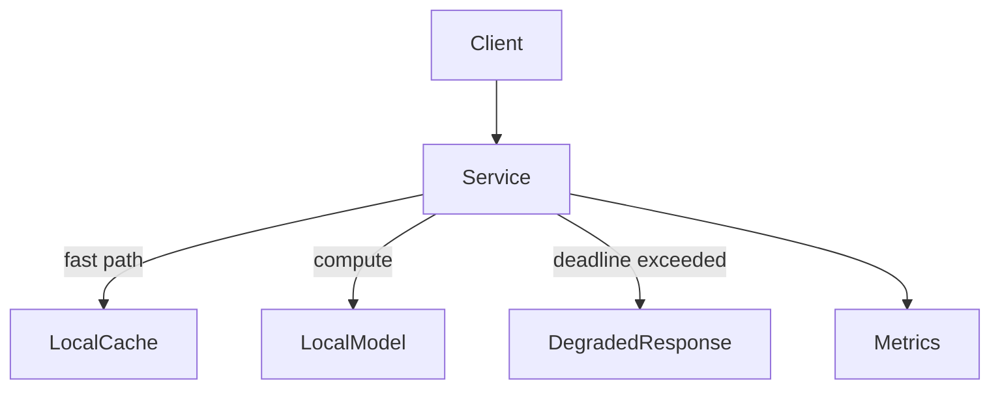

# rafaellima_AI_1

Enterprise-grade, **local-first AI service** with deterministic routing,  
hard deadlines, and production-grade observability.

Designed to demonstrate **platform, backend, and AI-infrastructure engineering**
practices in a real-world, production-oriented context.


---

## Why this matters

- **Local-first AI** reduces latency, operational cost, and data exposure compared to cloud-only inference.
- **Deterministic routing and deadlines** prevent unpredictable behavior and runaway compute costs.
- **Production guardrails** (CI, typing, Unicode safety) reflect real constraints faced by enterprise systems.

---

## What this demonstrates

- Designing **local-first AI services** with explicit failure and degradation paths
- **Deadline-aware execution** with graceful fallback behavior
- Production CI with **linting, typing, and tests** across multiple Python versions
- Defensive engineering against **Trojan Source / hidden Unicode attacks**
- Clean Python packaging using the **src/** layout and editable installs

---

## Architecture overview



``` Quickstart

pip install -e .
python examples/demo_cli.py
pytest
````
Repository structure
```
.
├── src/rafaellima_AI_1/      # Core service implementation
├── tests/                   # Unit and behavior tests
├── tools/                   # Unicode and security guardrails
├── examples/                # Minimal demo CLI
├── .github/                 # CI, issue and PR templates
└── pyproject.toml           # Packaging, linting, typing config
```
Engineering guarantees
Deterministic behavior: same inputs produce the same routing decisions
Deadline enforcement: hard execution limits with explicit degradation
Observability: metrics emitted for all execution paths
Security hygiene: Unicode normalization and Trojan Source protection
CI quality gates: ruff, mypy, pytest executed on every change
Portfolio note
This repository is intentionally scoped as a public portfolio artifact.
It demonstrates production-grade engineering practices and architectural decision-making without exposing proprietary models, datasets, or business logic.
