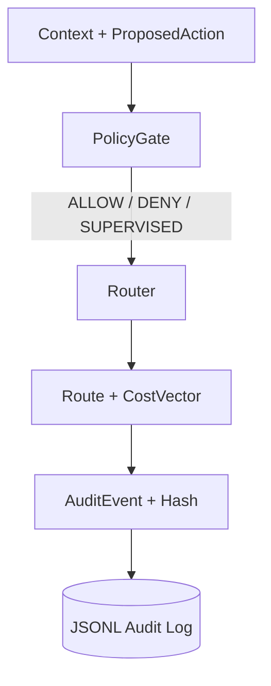

## Portfolio Note (Safe-to-Publish)
This repository is a public, generic demonstration of deterministic policy-based routing and auditable decision logs.
It is intentionally IP-safe and does not disclose any proprietary architectures, algorithms, or patent-related material.

Deterministic, auditable decision + policy engine for choosing execution routes (LOCAL / HYBRID /
CLOUD / DEGRADED) based on explicit cost vectors.

## What it is
A small, publishable Python project that demonstrates policy gating, route scoring, and audit trails
without external dependencies or remote calls.

## Why it matters
Transparent decisioning makes systems easier to trust, debug, and validate. This repo shows how to
keep routing logic reproducible with explicit inputs and canonical audit records.

## Skills Demonstrated
- Deterministic decision-making (same inputs → same outputs)
- Policy-based routing (LOCAL / HYBRID / CLOUD / DEGRADED)
- Explicit cost vectors and transparent scoring
- Auditability with structured JSONL events (traceable decisions)
- Test-driven engineering + CI hygiene

## Architecture overview


## Quickstart
macOS/Linux:
```bash
python -m venv .venv
source .venv/bin/activate
pip install -e ".[dev]"
python examples/demo_cli.py --scenario network_off
pytest
```

Windows PowerShell:
```powershell
python -m venv .venv
.venv\\Scripts\\Activate.ps1
pip install -e ".[dev]"
python examples\\demo_cli.py --scenario network_off
pytest
```

## Usage example
```python
from decision_policy_engine.models import Context, ProposedAction
from decision_policy_engine.policy.policy_gate import PolicyGate

context = Context(
    network_available=True,
    rtt_ms=120,
    battery_level=0.75,
    user_present=True,
    supervised_mode=False,
)
action = ProposedAction(type="NETWORK_CALL", risk_level="LOW")

policy_decision, reason = PolicyGate.evaluate(context, action)
print(policy_decision, reason)
```

### Audit trail output (short example)
```json
{"action_type":"NETWORK_CALL","cost_vector":{"dollar_cost":0.2,"latency_ms":200,"privacy_risk":0.15,"reliability_risk":0.2},"decision_id":"f7f2...","hash":"0cc7...","inputs_redacted":{"action":{"metadata":{},"risk_level":"LOW","type":"NETWORK_CALL"},"context":{"battery_level":0.75,"locale":"en-US","network_available":true,"rtt_ms":120,"supervised_mode":false,"user_present":true}},"policy_decision":"ALLOW","reason":"Action permitted.","route_selected":"HYBRID","timestamp_iso":"2024-01-01T00:00:00+00:00","trace_id":"a3b1..."}
```

## Determinism guarantee
- The same context, action, and cost vectors always yield the same policy decision, route, and audit
  hash.
- Canonical JSON serialization ensures stable hashing across runs.

## Threat model (high-level)
- **In scope:** accidental nondeterminism, inconsistent routing, incomplete audit logs.
- **Out of scope:** real cloud execution, secrets management, user authentication.

## Safe-to-publish boundary
- No external API keys.
- No live network calls.
- Only structured, redacted inputs are stored in the audit log.

## Design principles
- **Determinism:** same inputs yield the same decision, route, and audit hash.
- **Explicit cost vectors:** routing is driven by named, weighted signals.
- **Auditability:** canonical JSON and optional chained hashing for traceability.
- **Safe to publish:** no external API calls or secrets.

## Limitations
- Cost normalization uses fixed bounds suited to demo scenarios.
- Routing is based on a single scoring function and static weights.
- The audit log is local JSONL for simplicity.
